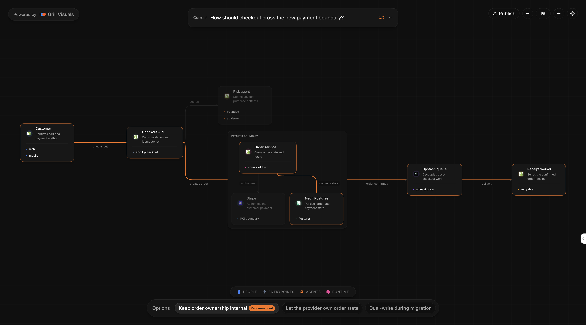

<div align="center">

# Grill Visuals

### Interactive decision diagrams for Grill Me

**Questions + options + visual paths = decision-ready context**

[](LICENSE)
[](https://www.typescriptlang.org/)
[](https://nodejs.org/)
[](https://pages.cloudflare.com/)

---



_See the decision. Understand the tradeoff. Share it only when needed._

</div>

---

## What is this?

Grill Visuals turns strict JSON from a coding agent into a polished, interactive diagram for each Grill Me question. One session becomes one self-contained, multi-question site with answer options, a recommended path, responsive canvas controls, and an optional public Cloudflare Pages link.

The project is experimental. All seven diagram families, local viewing, explicit publishing, verified updates, unsharing, and developer handoff are implemented.

---

## How It Works

```text
Coding agent asks a question     Native agent UI remains the answer surface
              |
              v
Strict diagram JSON              Schema rejects unknown or unsafe input
              |
              v
Family renderer                  Deterministic layout for the question shape
              |
              v
Local session viewer             Options, recommendation, pan, zoom, and Fit
              |
              v
Explicit Publish                 Privacy check and Cloudflare confirmation
              |
              v
Stable + immutable links         Latest session plus exact deployment version
```

---

## Diagram Families

| Family | Best for | Native interaction |
| --- | --- | --- |
| **Architecture** | Components, dependencies, data flow | Pan, zoom, path focus, node inspection |
| **Sequence** | Actors and time-ordered messages | Step and participant focus |
| **State** | States, guards, events, transitions | Transition and state inspection |
| **Mind map** | Scope, branches, related ideas | Branch focus and collapse |
| **Timeline** | Rollouts, incidents, migrations | Event focus and time navigation |
| **Quadrant** | Two-axis tradeoffs | Point inspection and group filters |
| **Comparison** | Repeated criteria across choices | Row, column, and rationale focus |

Every diagram also includes a complete text equivalent. Interaction adds clarity; it is never the only way to read the content.

---

## Product Principles

1. **Native questions first** — Developers answer through the coding agent, not the diagram page.
2. **Local by default** — Rendering never requires hosting or a remote runtime.
3. **One recommendation** — Each question highlights one recommended option and explains why.
4. **Explicit public sharing** — Nothing is uploaded until the developer confirms the destination and scope.
5. **Bounded input** — Strict schemas, content caps, and no agent-authored HTML or JavaScript.
6. **Readable at every size** — Responsive controls, keyboard access, reduced motion, and text equivalents.

---

## Quick Start

```bash
npm install
npm run build

node ./dist/bin/grill-visuals.js init --session demo
for file in examples/*.json; do
  node ./dist/bin/grill-visuals.js upsert --session demo --input "$file"
done
node ./dist/bin/grill-visuals.js open --session demo
```

`open` renders the session, starts the publishing-enabled loopback viewer at `http://127.0.0.1:8790`, and opens it. Stop that process when the session ends.

Local previews include [React Grab](https://react-grab.com). Hover an element and press **⌘C** or **Ctrl+C** to copy its exact DOM, styles, and source labels into a coding-agent conversation.

---

## CLI

| Command | Purpose |
| --- | --- |
| `families` | List supported diagram families |
| `init` | Create a local session |
| `validate` | Validate one diagram document |
| `upsert` | Add or update one question |
| `render` | Build the self-contained static site |
| `open` | Run and open the publishing-enabled local viewer |
| `serve` | Run the local viewer without opening it by default |
| `share` | Explicitly publish the whole session |
| `unshare` | Remove the exact recorded public project |
| `handoff` | Export a non-secret sharing receipt |
| `pickup` | Verify and import a confirmed receipt |

---

## Public Sharing

Authenticate once, then use the local viewer:

```bash
npx wrangler login
node ./dist/bin/grill-visuals.js open --session demo
```

Click **Publish** to review the Cloudflare account, complete session scope, active question, changed questions, and privacy findings. Confirming creates or updates one owned Pages project and returns:

- a stable URL that always shows the latest deployment
- an immutable URL for the exact deployment

Every published link is public to anyone who has it. No-index headers reduce discovery; they are not access control. High-confidence credentials block publishing, and weaker matches require explicit review.

Remove only the recorded project:

```bash
node ./dist/bin/grill-visuals.js unshare --session demo --yes
```

---

## Tech Stack

| Layer | Technology |
| --- | --- |
| Runtime and CLI | TypeScript + Node.js 22+ |
| Layout | Deterministic family renderers + ELK |
| Interaction | Typed browser runtime + Motion |
| Local inspection | React Grab |
| Public hosting | Cloudflare Pages via Wrangler |
| Output | Self-contained HTML, CSS, fonts, icons, and JavaScript |

---

## Development

```bash
npm install
npm run typecheck
npm test
npm run check
```

Authored runtime, CLI, build, and test code is TypeScript. `npm run build` compiles Node modules into `dist/` and bundles the browser viewer. Generated JavaScript and rendered session sites are build output.

To smoke-test only the static Pages output:

```bash
npx wrangler pages dev .context/grill-visuals/demo/site
```

That static server cannot publish. Use `grill-visuals open` when testing the **Publish** flow.

---

## Documentation

| Document | Purpose |
| --- | --- |
| [Specification](SPEC.md) | Product contract, trust boundary, families, and release gates |
| [Security](SECURITY.md) | Public-sharing, credential, ownership, and handoff rules |
| [Third-party notices](THIRD_PARTY_NOTICES.md) | Bundled dependency licenses and notices |

---

## License

[Apache-2.0](LICENSE)

---

<div align="center">

_Built by [Nairon AI](https://github.com/Nairon-AI)_

**Make the decision visible before you build it.**

</div>
